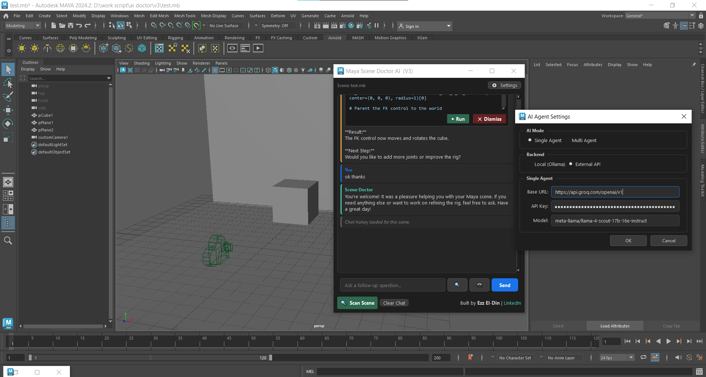

# 🩺 Maya Scene Doctor AI


**Maya Scene Doctor AI** is a professional-grade artificial intelligence assistant built directly into Autodesk Maya. It bridge the gap between technical complexity and artistic workflow by providing a "Doctor" that can instantly diagnose, explain, and repair complex 3D scenes.



Built by **Ezz El-Din** | [LinkedIn](https://www.linkedin.com/in/ezzel-din-tarek-mostafa)

---

## 📖 The Project Mission

Manual troubleshooting in Maya is often the most time-consuming part of a 3D artist's day. Whether it's tracking down a broken shader, fixing non-manifold geometry, or optimizing render settings, these tasks pull artists away from their creative work.

**Maya Scene Doctor AI** solves this by using specialized AI agents that act as a virtual Technical Director (TD). It doesn't just find problems; it understands them and provides the code to fix them instantly.

---

## 🧠 Core Architecture: Multi-Agent Intelligence

The project utilizes a sophisticated multi-agent system where different AI "experts" collaborate to solve your scene's problems:

- **🔍 The Analyzer Agent**: Performs a deep forensic scan of the Maya scene. It translates technical data into plain human language, explaining *why* an issue is a problem and what its impact might be.
- **🔧 The Code Writer Agent**: A Maya Python specialist. Once the Analyzer identifies a problem, the Code Writer generates optimized, self-contained scripts to fix it. Every script is safe, editable, and built specifically for your scene state.
- **👁 The Vision Agent**: A visual quality control expert. It can "see" your viewport, allowing it to evaluate lighting quality, detect visual artifacts, and verify that a fix actually looks right.
- **💬 The Summary Agent**: Manages the conversation context, ensuring that as you chat with the doctor, it stays focused on the most important tasks without losing track of previous fixes.

---

## 🔍 Deep Scene Diagnostics

The "Doctor" doesn't just look at the surface. It performs a comprehensive health check across the entire Maya ecosystem:

- **Geometry Health**: Detects non-manifold edges, lamina faces, zero-area faces, and construction history bloat.
- **Shading & Textures**: Identifies broken shading networks, missing texture paths, and unassigned materials.
- **Lighting & Rendering**: Checks for zero-intensity lights, hidden light sources, overexposed areas, and unoptimized render settings.
- **Scene Rigidity**: Monitors the joint hierarchy, skin clusters, locked attributes, and potential rigging bottlenecks.
- **Reference Management**: Tracks loaded/unloaded references and identifies missing external files.
- **Data Cleanup**: Finds unknown nodes, empty groups, and "zombie" data that can cause scene instability or file bloat.

---

## 🛠 Features for the Modern Artist

- **Zero-Dependency Integration**: Built entirely with native Maya libraries (`urllib`, `PySide`). You don't need to install `pip`, `requests`, or manage complex Python environments.
- **Agentic Verification**: The AI doesn't just "hope" the fix worked. It can automatically take a screenshot after running code, evaluate the result, and iterate if necessary.
- **Local & Cloud Flexibility**: Run completely offline using **Ollama** for privacy and speed, or connect to high-performance cloud models like **GPT-4o** or **Groq**.
- **Integrated Web Search**: If a problem requires a third-party plugin or a specific tutorial, the AI can search GitHub, Gumroad, and 80 Level to find the exact resource you need.
- **Persistent Scene History**: Every Maya file carries its own "medical history." When you reopen a scene, the Doctor remembers previous scans and conversations.

---

## 🚀 Getting Started

### Installation
1. **Download** the repository files.
2. Place the files in your Maya scripts folder (e.g., `Documents/maya/scripts/`).
3. In a **Python** tab in the Maya Script Editor, run:

```python
import main
main.show()
```

### Setup
- Click the **Settings (⚙️)** icon to choose your AI backend.
- **Local**: Use Ollama (`http://localhost:11434`).
- **Cloud**: Use any OpenAI-compatible API key.

---

## 🤝 Community & Support

This project is built to empower the Maya community. If you have ideas for new scanning rules or agent behaviors, we encourage you to open an issue or contribute a pull request.

---

## 📜 License

This project is licensed under the **MIT License** - see the [LICENSE](LICENSE) file for details.

Built with ❤️ by **Ezz El-Din** | [LinkedIn](https://www.linkedin.com/in/ezzel-din-tarek-mostafa)
